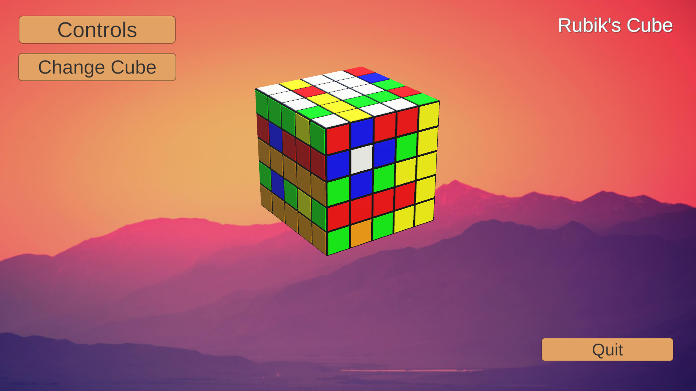

# Rubik's Cube

## Presentation
-----------

### Introduction
-----------
 `Rubik's Cube` is a PC game made on Unity 3D.  
 The objective of this project was to make a Rubik's Cube by using quaternions, vectors, and planes without using some Unity functions such as Rotate and Rotate Around  
 This project has been made by **RABINNE Lenny** and **ERBISTI Matéo**.  
 This project really helped us to understand how quaternions can be useful in games and how to use them. 

### Edit the Cube
-----------
By pressing the 'Change Cube' button you can choose the size of the cube (from 2 to 10) and the shuffle size (from 1 to 100)  

### Controls :
-----------
Hold the right mouse button + movement: Rotate the cube
Hold the left mouse button + movement: Rotate the face
Wheel mouse: Zoom In/Out
